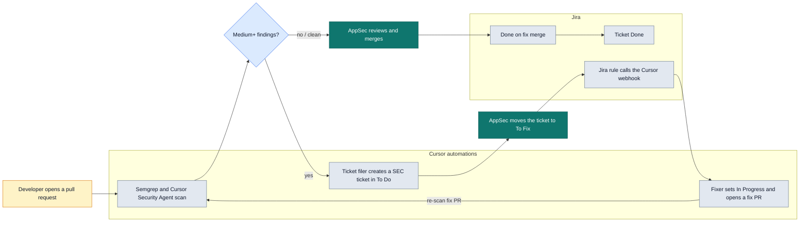

> [!WARNING]
> **INTENTIONALLY VULNERABLE — DEMO ONLY.** This repo contains seeded security flaws used to demonstrate a review loop. Do not deploy it, do not expose it to the internet, and do not copy its code into a real project.

# Row Nine demo runbook

Small event-ticketing app used to show a seeded pull request moving through scan, ticket, fix, and close.

## What this demo shows

A pull request carries two seeded flaws:

- Reflected cross-site scripting in `GET /promo` (CWE-79). The `message` query value is written into the banner as HTML.
- An open redirect in `GET /go` (CWE-601). `next` is sent as the redirect target.

On that pull request:

1. **Semgrep** (GitHub Action) and the **Cursor Security Agent** (Security Reviewer) scan the change.
2. A Cursor automation files **Jira SEC** tickets for findings at Medium or higher.
3. AppSec triages one ticket to **To Fix**.
4. A Jira rule calls a Cursor webhook automation. That automation moves the ticket to **In Progress** and opens a ready-for-review fix pull request, which is scanned again.
5. AppSec reviews and merges the fix.
6. A Jira rule, **Done on fix merge**, moves the ticket to **Done**.

## Prerequisites

- Access to this GitHub repo. The Semgrep workflow (`.github/workflows/semgrep.yml`) is on `main`.
- A Cursor Enterprise team with the Security Reviewer automation **syolab-appsec-demo**. It triggers when a pull request is opened or pushed.
- Cursor automation **syolab-appsec-ticket-filer**, with the Jira (Atlassian) MCP connected. Reconnect it shortly before the demo. The connection drops after about an hour.
- Cursor webhook automation **syolab-appsec-ticket-fixer**. Prompt step 0 moves the ticket to In Progress and adds a comment. Fix pull requests must open **ready for review**, not as drafts.
- Jira project **SEC**, work type **Vulnerability**, statuses **To Do**, **To Fix**, **In Progress**, and **Done**.
- Jira automation rule 1: when a work item is transitioned to **To Fix**, send a web request.
  - Method: `POST`
  - URL: the Cursor webhook URL for **syolab-appsec-ticket-fixer**
  - Header `Content-Type`: `application/json`
  - Header `Authorization`: `Bearer <Cursor API key>`
  - Use a placeholder in docs and slides. Never commit a real token.
- The **GitHub for Jira** app installed on the account that owns this repo.
- Jira automation rule 2, **Done on fix merge**: when a pull request is merged, if status is not **Done**, transition the work item to **Done**.

Run the app locally with Node.js 18 or newer:

```bash
npm install
npm start
```

Open http://localhost:3000.

## Run the demo

1. From the current tip of `feature/promo-links`, create a fresh rehearsal branch. Do not commit on `feature/promo-links` itself.
2. Merge `main` into that branch so Semgrep is present.
3. Make a trivial change (a README comment is enough) and open a **non-draft** pull request into `main`.
4. Watch the **SAST (Semgrep)** check and **Cursor Security Agent: syolab-appsec-demo**. Confirm the findings on the promo page and on `/go`.
5. Watch **Cursor Automation: syolab-appsec-ticket-filer** file the SEC tickets. Expect a **Critical** cross-site scripting ticket and a **High** open-redirect ticket.
6. Move one ticket to **To Fix**.
7. Within about 2 minutes the ticket moves to **In Progress**.
8. Within about 3 minutes a fix pull request titled `SEC-n: ...` opens and is re-scanned clean.
9. Merge that fix pull request. The ticket moves to **Done**.

From today's dry run: scan plus filing takes about **6–7 minutes**. From **To Fix** to **Done** takes about **6 minutes**.

## Troubleshooting

| What you see | What to check |
| --- | --- |
| No review on the fix pull request | It was opened as a draft. The fixer must open it ready for review. |
| Ticket does not move to Done after merge | GitHub for Jira is installed, and the **Done on fix merge** rule's audit log. |
| No SEC tickets | The Jira MCP connection on **syolab-appsec-ticket-filer**. Reconnect it. |
| Semgrep does not run | The pull request targets `main`, where `.github/workflows/semgrep.yml` lives. |

## Reset after the demo

- Close the demo pull requests without merging, except a fix you intentionally merged.
- Delete the rehearsal branches you created.
- Leave `feature/promo-links` untouched. It is the seed for the next run.
- Regenerate the Cursor API key used in the Jira web request, and update the rule. Do not store that key in this repo.

## Flow

The fix pull request comes back to the same scan. A clean scan is what AppSec merges.



Legend: **teal** is a person on the AppSec team (triage to To Fix, then review and merge). **amber** is the developer opening the pull request. **gray** is automation, grouped as Cursor automations and Jira. **blue** is the Medium+ findings decision. The edge labeled **re-scan fix PR** is the loop back into the same scan.
